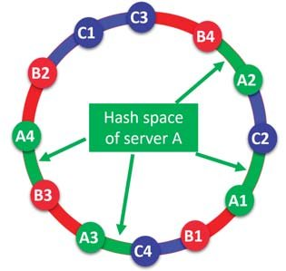

The basic idea behind the consistent hashing algorithm is to hash both objects and caches using the same hash function. The reason to do this is to map the cache to an interval, 
which will contain a number of object hashes. If the cache is removed then its interval is taken over by a cache with an adjacent interval. All the other caches remain unchanged.

### Alternative illustration

### Reference materials
1) [Consistent hashing](https://en.wikipedia.org/wiki/Consistent_hashing)
2) [Consistent Hashing](https://tom-e-white.com/2007/11/consistent-hashing.html)
3) [Dynamo: Amazon’s Highly Available Key-value Store](https://www.allthingsdistributed.com/files/amazon-dynamo-sosp2007.pdf)
4) [Cassandra - A Decentralized Structured Storage System](http://www.cs.cornell.edu/Projects/ladis2009/papers/Lakshman-ladis2009.PDF)
5) [How Discord Scaled Elixir to 5,000,000 Concurrent Users](https://blog.discord.com/scaling-elixir-f9b8e1e7c29b)
6) [CS168: The Modern Algorithmic Toolbox Lecture #1: Introduction and Consistent Hashing](http://theory.stanford.edu/~tim/s16/l/l1.pdf)
7) [Maglev: A Fast and Reliable Software Network Load Balancer](https://static.googleusercontent.com/media/research.google.com/en//pubs/archive/44824.pdf)