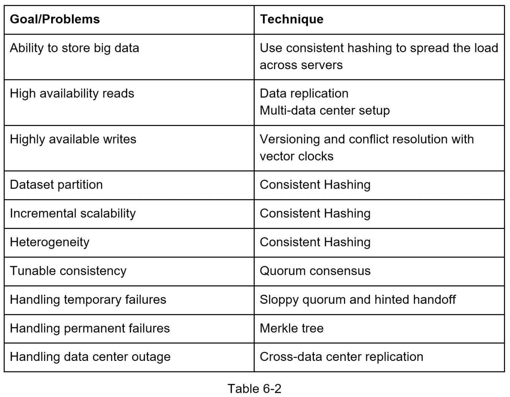

### Data partitioning and replication
* Using consistent hashing to partition data allows:  
  **Automatic scaling**: servers could be added and removed automatically depending on the load.
  **Heterogeneity**: the number of virtual nodes for a server is proportional to the server capacity.(servers with higher capacity are assigned with more virtual nodes.)
* To achieve high availability and reliability, data must be replicated asynchronously over N distinct servers
### Consistency
Quorum consensus can guarantee consistency for both read and write operations.  
`N = Number of replicas`  
`W = A write quorum of size W`. For a write operation to be considered as successful, write operation must be acknowledged from W replicas.  
`R = A read quorum of size R`. For a read operation to be considered as successful, read operation must wait for responses from at least R replicas.  
If `R = 1 and W = N`, the system is optimized for a fast read.  
If `W = 1 and R = N`, the system is optimized for fast write.  
If `W + R > N`, strong consistency is guaranteed (Usually N = 3, W = R = 2).  
If `W + R <= N`, strong consistency is not guaranteed.  

#### Inconsistency resolution: versioning  

  
A vector clock is a `[server, version]` pair associated with a data item. It can be used to check if one version precedes, succeeds, or in conflict with others.  

#### Handling failures

##### Temporary failures
In a distributed system, usually, it requires at least two independent sources of information to mark a server down.
All-to-all multicasting is a straightforward solution. However, this is inefficient.
A better solution is to use decentralized failure detection methods like [`Gossip protocol`](https://martinfowler.com/articles/patterns-of-distributed-systems/gossip-dissemination.html).
<details>
Gossip protocol works in the following way:  

• Each node maintains a node membership list, which contains member IDs and heartbeat counters.  
• Each node periodically increments its heartbeat counter.  
• Each node periodically sends heartbeats to a set of random nodes, which in turn propagate to another set of nodes.  
• Once nodes receive heartbeats, membership list is updated to the latest info.  
• If the heartbeat has not increased for more than predefined periods, the member is considered as offline.  

The cluster node receiving the gossip message inspects the metadata it has and finds:    
* The values which are in the incoming message but not available in this node's state map  
* The values which it has but the incoming Gossip message does not have  

The higher version value is chosen when the node has the values present in the incoming message  
It then adds the missing values to its own state map. Whatever values were missing from the incoming message, are returned as a response.
The cluster node sending the Gossip message adds the values it gets from the gossip response to its own state.  
</details>

If failures were detected during Gossip protocol evaluation, in order to increase availability of the system, `sloppy quorum` can be used instead of `strict quorum` (which will block till selected nodes become available again).
Instead of enforcing the quorum requirement, the system chooses the first W healthy servers for writes and first R healthy servers for reads on the hash ring. Offline servers are ignored.  
If a server is unavailable due to network or server failures, another server will process  requests temporarily. When the down server is up, changes will be pushed back to achieve  data consistency. This process is called `hinted handoff`.

##### Permanent failures

What if a replica is permanently unavailable? To handle such a situation, we implement an anti-entropy protocol to keep replicas in sync. Anti-entropy involves comparing each piece of data on replicas and updating each replica to the newest version. A Merkle tree is used for inconsistency detection and minimizing the amount of data transferred.  
```“A hash tree or Merkle tree is a tree in which every non-leaf node is labeled with the hash of the labels or values (in case of leaves) of its child nodes. Hash trees allow efficient and secure verification of the contents of large data structures”.```


##### System design

  

  

  

##### Summary



### Reference materials
1) [Gossip protocol](https://martinfowler.com/articles/patterns-of-distributed-systems/gossip-dissemination.html)
2) [SStable:](https://www.igvita.com/2012/02/06/sstable-and-log-structured-storage-leveldb/)
3) [Bloom filter](https://en.wikipedia.org/wiki/Bloom_filter)