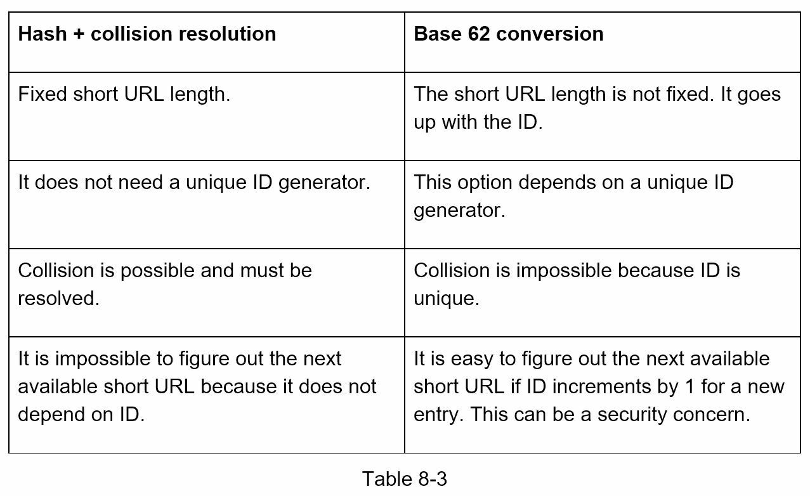

#### Requirements:
• Read-to-write operations ratio 10:1  
• Average URL length is 100  
• Shorten URL length = 7 symbols.

#### APIs:
We need 2 APIs: one for long->short URL conversion and another for redirecting from short URL to original.  


#### Hashing:  
The hashValue consists of characters from `````[0-9, a-z, A-Z]`````, containing ```10 + 26 + 26 = 62```possible characters.   

| n   | max number of URLs  |
|-----|---------------------|
| 1   | 62^1 = 62           |
| 2   | 62^2 = 3844         |
| ... | ...                 |
| 7   | 62^7 = 3,5 Trillion |


| hash fn      | sample hash value                        |
|--------------|------------------------------------------|
| <b>CRC32</b> | bd9fbfb5 (too lengthy, 8 instead of 7)   |
| MD5          | e0bbd2b173004746b586f8e2a9e74bae         |
| SHA1         | 619a5517c009e24a8c9991bdffe31dfaf8979b3e |

How can we shorten `CRC32` hash from 8 to 7 signs?  
1) Hash collision resolution:  


2) Base 62 conversion:  
   Base 62 conversion is used as there are `62 possible characters for hashValue`.  
   for ex.  `11157 represents 11157 in a base 10 system` and if we use Base 62, mappings will be as following:  

| Base 10 | Base 62 |
|---------|---------|
| 0       | 0       |
| 1       | 1       |
| ...     | ...     |
| 10      | a       |
| 11      | b       |
| ...     | ...     |
| 61      | Z       |

11157 = 2 x 62^2 + 55 x 62^1 + 59 x 62^0 = `[2, 55, 59]` -> `[2, T, X]` in base 62  

#### Base 62 flow:





#### System design:


### Reference materials

